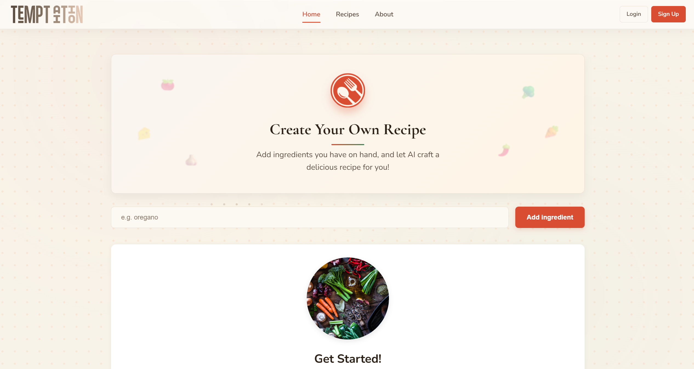

# 🍲 TemptAItion - Recipe Generator


## ✨ Turn Ingredients into Culinary Magic

<p align="center">
  
</p>

**TemptAItion** is an AI-powered culinary assistant that transforms everyday ingredients into delicious recipes — using the power of generative AI. Whether you're a beginner or a seasoned cook, this tool helps you discover new meals effortlessly.

### 🚀 [Live Demo - Launch Website](https://recipe-generator-ashy.vercel.app/)

---

## ⭐ Features

-  **AI Recipe Creation** — Enter your ingredients and get personalized recipes instantly  
-  **Recipe Regeneration** — Not satisfied? Instantly generate an alternate recipe  
-  **Save Recipes** — Save your favorite AI-generated recipes to your personal profile  
-  **User Authentication** — Secure sign up/login to manage saved recipes  
-  **Profile Page** — Access your saved recipes in a clean and organized dashboard  
-  **Curated Recipes** — Browse a selection of chef-approved dishes  
-  **Ingredient Suggestions** — Get suggestions when you're unsure what to use  
-  **Responsive Design** — Seamless experience across devices  

---

## 🔍 How It Works

1. **Add Ingredients** — Enter the items you have  
2. **Generate Recipe** — AI creates a custom recipe based on your input  
3. **Regenerate (Optional)** — Get alternate suggestions instantly  
4. **Save Recipe** — Log in to save recipes to your profile  
5. **Cook & Enjoy** — Follow the instructions and enjoy your meal!  

---

## 🔧 Tech Stack

- **Frontend:** React, CSS3  
- **AI Integration:** Google Gemini API  
- **Authentication:** Supabase Auth  
- **Database:** Supabase  
- **Routing:** React Router  
- **Deployment:** Vercel  

---

## 🖥️ Local Development

```bash
# Clone the repository
git clone https://github.com/Akshith-cdr/Recipe-Generator.git

# Navigate to project directory
cd Recipe-Generator

# Install dependencies
npm install

# Create .env file with your API key
echo "VITE_GEMINI_API_KEY=your_api_key_here" > .env.local

# Start development server
npm run dev
```

## 🔮 Future Enhancements

- Dietary filters (Vegan, Keto, Gluten-Free)
- Shopping list generation based on saved recipes
- Multi-language support
- Recipe rating and comment system
- AI usage insights in profile

## 👨‍💻 Author

Created with ❤️ by [Akshith](https://github.com/Akshith-cdr)

---

<p align="center">
  <i>If you found this project helpful, please consider giving it a star! ⭐</i>
</p>
